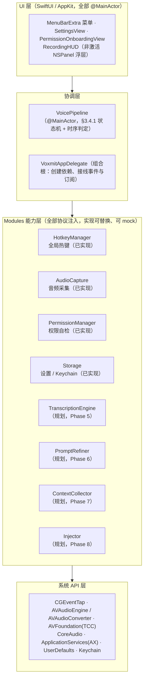
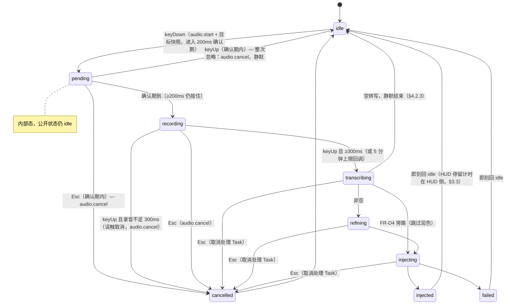
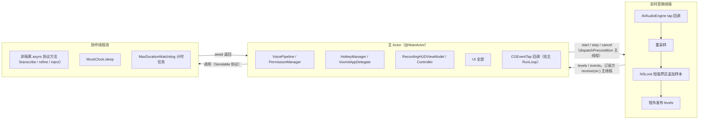
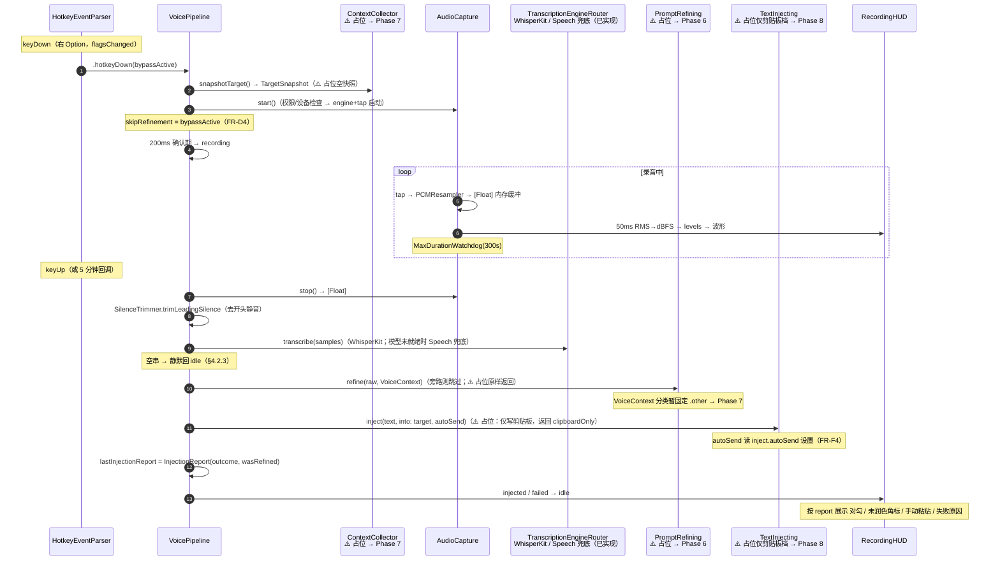

# Voxmit 架构设计文档

> 项目唯一的架构设计文档。读者：新加入的工程师或 AI 代理。
> 本文同时记录**设计意图**（从需求文档推导的架构决策）与**已落地实况**（Phase 0–4 as-built）；未实现部分一律标注"（规划，Phase X）"，不把规划写成已实现。
>
> 引用约定：`§x.y` 指 `语音编程工具-需求分析与方案说明.md` 对应小节；`FR-xN` 指其中的需求编号。需求文档是唯一事实来源，本文与其冲突时以需求文档为准并回改本文。
>
> 实现状态基线：2026-08-18，Phase 0–4 已完成（`PLAN.md`），单测 86 用例全绿。

## 目录

- [1. 架构总览](#1-架构总览)
- [2. 设计原则](#2-设计原则)
- [3. 主链路状态机](#3-主链路状态机)
- [4. 模块详章](#4-模块详章)
- [5. 并发与线程模型](#5-并发与线程模型)
- [6. 端到端数据流](#6-端到端数据流)
- [7. 权限与降级矩阵](#7-权限与降级矩阵)
- [8. 存储与安全](#8-存储与安全)
- [9. 性能预算](#9-性能预算)
- [10. 目录结构](#10-目录结构)
- [11. 测试架构](#11-测试架构)
- [12. 与需求文档的一致性](#12-与需求文档的一致性)

---

## 1. 架构总览

核心链路一句话：**按住全局热键说话 → 本地语音转写 → LLM 润色为工程 Prompt → 自动注入当前 AI 开发工具的输入框**（§1.2）。架构形态为菜单栏常驻 Agent（`LSUIElement = true`，无主窗口），围绕一条由状态机驱动的主链路组织。



层次依赖规则：UI → 协调层 → 能力层 → 系统 API 层；能力层模块之间不直接互相依赖（如 AudioCapture 不认识 HotkeyManager），一切协作经 VoicePipeline 或 VoxmitAppDelegate 接线。

## 2. 设计原则

### 2.1 协议隔离可测试（§9.1）

主链路上的每一类下游能力都抽象为协议，定义在 `Voxmit/Pipeline/Models.swift`（照抄 §9.1 契约）：

- `TranscriptionEngine` / `PromptRefining` / `TextInjecting`（§9.1，均带 `Sendable` 约束——Swift 6 严格并发要求，见 §5）
- `AudioCapturing` / `ContextCollecting`（§9.1，Phase 2/3 实现期定义、需求文档 v0.4 收录）

VoicePipeline 只面向协议编程，系统实现（`AudioCapture`、未来的 `WhisperKitEngine` 等）在组合根（`VoxmitAppDelegate`）注入；单测用 mock 注入，**核心逻辑零系统权限可测**（`docs/TESTING.md` 的硬性要求）。协议未实现的模块用 no-op 占位接线（`Voxmit/Pipeline/PlaceholderServices.swift`），命名统一 `NoOp*`/`Placeholder*` 前缀防止误用。

### 2.2 降级优先（权限矩阵驱动，§4.4）

三项系统权限的缺失不导致崩溃，而是沿 §4.4 矩阵降级。所有降级决策收敛在纯值类型 `PermissionSnapshot`（`Voxmit/Modules/Permissions/PermissionManager.swift`）上：`canRecord` / `canUseGlobalHotkey` / `injectionCapability` / `requiredGranted` / `allGranted`。快照经 Combine 实时同步到 VoicePipeline 与各消费方，权限运行中变化即刻生效（详见 §7）。

### 2.3 纯逻辑与系统交互分离

凡是能脱离系统 API 表达的判定逻辑，都拆成纯值类型/纯函数独立成件，系统交互只剩薄壳：

| 模式 | 纯逻辑（可单测） | 系统薄壳（真机验收） |
|---|---|---|
| 热键 | `HotkeyEventParser`（CGEvent 标量 → `HotkeyAction`） | `HotkeyManager` 的 tap 生命周期 |
| 音频 | `AudioProcessing.swift`：电平/静音裁剪/重采样/设备决策 | `AudioCapture` 的 engine 生命周期 |
| 权限 | `PermissionSnapshot` 降级决策 | `SystemPermissionChecker` 的 TCC 调用 |
| HUD | `HUDVisibility` 停留决策、`LevelHistory` | `RecordingHUDController` 的 NSPanel |

### 2.4 时钟注入

所有"等待"都经 `PipelineClock` 协议（`Voxmit/Pipeline/PipelineClock.swift`：`now` + 可取消的 `sleep(for:)`），生产用 `SystemPipelineClock`，单测用 `MockClock` 虚拟时间手动推进——200ms/300ms/5 分钟/HUD 停留全部确定性测试，零真实睡眠。关键约定：**截止时刻锚定在事件发生时**（`remaining = 阈值 - (now - 事件时刻)`），而非任务首次被调度的时刻，否则虚拟时钟下存在"调度晚于推进"的竞态（实现踩坑见 `docs/implementation-notes.md`）。

### 2.5 最小改动，按优先级实现

严格按 FR 优先级（P0 → P1 → P2）动工，不提前实现（`CONTRIBUTING.md`）；下游模块以占位实现接线，状态机与数据流先行完整，真实能力逐 Phase 替换占位。

## 3. 主链路状态机

实现于 `Voxmit/Pipeline/VoicePipeline.swift`（@MainActor `ObservableObject`），状态枚举 `VoicePipelineState` 定义于 `Voxmit/Pipeline/Models.swift`（§3.4.1 八态）。时序判定集中在这一层（§4.2.0），HotkeyManager 只上报原始按下/松开事件。

### 3.1 状态迁移图



终止态（injected / failed / cancelled）在状态机内即刻回 idle；HUD 停留计时在 HUD 侧（见 §3.3）。

### 3.2 事件与判定表

| 事件 | 入口方法 | 守卫条件 | 动作 |
|---|---|---|---|
| 热键按下 | `handleHotkeyDown(bypassModifierActive:)` | idle 且无 pending；`permissionSnapshot.canRecord` | 快照目标（`contextCollector.snapshotTarget()`）→ `audio.start()` → 200ms 确认期计时 |
| keyDown 且无麦克风权限 | 同上 | `!canRecord` | `failed("未授予麦克风权限")` → idle |
| `audio.start()` 抛错 | 同上 | — | `failed("无法开始录音：…")` → idle |
| 确认期通过 | 内部 Task | pending 未被取消 | → `recording`（startedAt = 确认时刻） |
| 热键松开 | `handleHotkeyUp()` | 确认期内 | 整次忽略（§3.4.2）：`audio.cancel()`，无状态变化 |
| 热键松开 | 同上 | recording 时长 < 300ms | 误触取消（§3.4.2）：`audio.cancel()` → cancelled → idle |
| 热键松开 | 同上 | recording 时长 ≥ 300ms | → 处理链（§6） |
| Esc | `cancel()` | pending / recording | `audio.cancel()` → cancelled → idle |
| Esc | 同上 | 处理中 | 取消处理 Task（Task cancellation，§4.2.0）→ cancelled → idle |
| 5 分钟上限 | `handleMaxRecordingDuration()` | recording（由 AudioCapture 看门狗回调，FR-A3） | 等同 keyUp，按松手流程处理已录部分 |
| 菜单点击 | `handleMenuToggle()` | idle → 开始；recording → 停止 | 与热键路径完全等价（§4.4 降级入口） |

时序常量（`VoicePipeline` 静态属性）：`confirmationDelay = 0.2`、`minimumRecordingDuration = 0.3`、`maximumRecordingDuration = 300`（秒）。旁路修饰键（FR-D4）在 keyDown 瞬间由 HotkeyEventParser 判定、随事件传入，Pipeline 记为 `skipRefinement`，处理链中跳过 refining 态直接注入原文。

### 3.3 为什么不给状态机加"停留"

§3.4.1 图中 injected"短暂停留后回 idle"。实现上状态机**即刻回 idle**（`finish(with:)` 同步两次赋值），停留时长（成功 0.8s / 未润色 1.2s / 手动粘贴 2.5s / 失败 2.5s）由 HUD 侧自理：`UI/RecordingHUD.swift` 的 `HUDVisibility` 纯函数按"状态 + `lastInjectionReport`"决策隐藏延迟，Controller 用 `PipelineClock` 调度。理由：停留是**展示职责**而非链路职责；状态机保持瞬时迁移可让单测用 Combine 历史精确断言全序列，HUD 计时独立演化（如未来接提示音）不再触碰状态机。代价是要对"终止态后紧跟的 idle"去抖两处（Controller 已有 hideTask 时忽略、ViewModel 锁存终止态展示），已在实现与测试中固化（见 `docs/implementation-notes.md` 录音 HUD 节）。

状态经 `@Published state` 发布，菜单栏图标（`menuBarIcon`）与状态文案（`statusText`）是其纯派生。

## 4. 模块详章

> 每节：职责 / 关键类型 / 协议边界 / 实现状态 / 需求文档依据。

### 4.1 VoicePipeline —— 主链路协调器（已实现，Phase 2 起）

- **职责**：驱动 §3.4.1 状态机，串联 热键 → 音频 → 上下文 → 转写 → 润色 → 注入；时序判定集中（§4.2.0）。
- **关键类型**：`VoicePipeline`（`Voxmit/Pipeline/VoicePipeline.swift`）；`VoicePipelineState` / `TargetSnapshot` / `VoiceContext` / `InjectionReport`（`Voxmit/Pipeline/Models.swift`）。
- **依赖（init 全协议注入）**：`PipelineClock`、`AudioCapturing`、`TranscriptionEngine`、`PromptRefining`、`TextInjecting`、`ContextCollecting`，外加 `autoSend: () -> Bool` 设置读取闭包（默认读 `inject.autoSend`，FR-F4）。
- **对外发布**（Combine）：`state`、`permissionSnapshot`、`targetSnapshot`、`lastInjectionReport`；派生：`canUseGlobalHotkey`、`injectionCapability`、`isRecording`、`menuBarIcon`、`statusText`。
- **需求依据**：§3.4.1、§3.4.2、§4.2.0、§4.3。

### 4.2 PermissionManager —— 权限检测与引导（已实现，Phase 1）

- **职责**：三权限检测、麦克风授权请求、系统设置深链跳转、首启引导判定（FR-G5）。
- **关键类型**（`Voxmit/Modules/Permissions/PermissionManager.swift`）：`PermissionKind`（顺序即引导顺序：麦克风 → 输入监控 → 辅助功能）、`MicrophonePermissionStatus`、`PermissionSnapshot`（降级决策收敛点）、`PermissionChecking`（系统 API 隔离协议）、`SystemPermissionChecker`、`PermissionManager`（@MainActor `ObservableObject`）。
- **系统 API 对照（§4.4）**：麦克风 `AVCaptureDevice.authorizationStatus(for: .audio)`、输入监控 `CGPreflightListenEventAccess()`、辅助功能 `AXIsProcessTrusted()`；深链 `x-apple.systempreferences:com.apple.preference.security?Privacy_*`（macOS 26 实测有效，验证方法见 `docs/implementation-notes.md`）。
- **需求依据**：§4.4、FR-G5。

### 4.3 HotkeyManager —— 全局热键（已实现，Phase 2）

- **职责**：CGEventTap **listen-only** 监听（只需"输入监控"权限，§4.2.1），产出"按下/松开/Esc"语义事件；tap 自愈。
- **关键类型**（`Voxmit/Modules/Hotkey/HotkeyManager.swift`）：`HotkeyEventParser`（纯解析器：右 Option 0x3D 沿判定、按住期间其他修饰键不影响、keyDown 瞬间旁路判定、Esc 0x35、`tapDisabledBy*` 识别、修饰键 keyCode→flags 映射）、`HotkeyAction`、`HotkeyManager`（@MainActor）。
- **健壮性（§4.2.1）**：回调内收 `tapDisabledByTimeout/UserInput` 立即 `CGEvent.tapEnable`；5s 看门狗巡检 `CGEvent.tapIsEnabled` 与 `CFRunLoopSourceIsValid`，失效整体重建。
- **权限驱动**：订阅 `PermissionManager.$snapshot`，`canUseGlobalHotkey` 变化即 start/stop——权限补齐自动生效、撤销自动停止（菜单降级入口接管）。
- **事件出口**：`onHotkeyDown((Bool) -> Void)`（参数 = 旁路修饰键是否按下）/ `onHotkeyUp` / `onEscape`，由 VoxmitAppDelegate 接到 Pipeline。
- **需求依据**：§4.2.1、§3.4.2、FR-B1/B5/D4。

### 4.4 AudioCapture —— 音频采集（已实现，Phase 3）

- **职责**：AVAudioEngine 采集 + AVAudioConverter 重采样 16kHz 单声道 Float32，内存缓冲不落盘；50ms 电平；设备热切换；5 分钟上限；静音前缀裁剪（纯函数，Pipeline 在转写前调用）。
- **关键类型**：
  - `Voxmit/Modules/Audio/AudioCapture.swift`：`AudioCapture`（`AudioCapturing` 实装）、`MaxDurationWatchdog`（上限计时，时钟注入）、`AudioCaptureEvent`（`maxDurationReached` / `inputDeviceFellBackToDefault` / `captureInterrupted`）、`AudioCaptureError`、`InputDeviceCatalog`（DiscoverySession 枚举）、`InputDeviceLookup`（CoreAudio UID→AudioDeviceID）。
  - `Voxmit/Modules/Audio/AudioProcessing.swift`（纯逻辑）：`AudioLevelMeter`（RMS→dBFS，800 样本 = 50ms 窗口）、`SilenceTrimmer`（-45dBFS 阈值 + 50ms 前导保留）、`PCMResampler`、`InputDeviceResolver`。
- **发布通道**：`levels: PassthroughSubject<Float, Never>`（dBFS，音频线程发布）、`events: PassthroughSubject<AudioCaptureEvent, Never>`；`onMaxDurationReached` 回调由 VoxmitAppDelegate 接到 `VoicePipeline.handleMaxRecordingDuration()`。
- **需求依据**：§4.2.2、FR-A1/A2/A3。

### 4.5 TranscriptionEngine —— 转写（已实现，Phase 5）

- **协议（§9.1）**：`TranscriptionEngine: Sendable`（`transcribe(samples:) async throws -> String`）。
- **实现**（`Voxmit/Modules/Transcription/`）：
  - `WhisperKitTranscriptionEngine`：默认引擎（FR-C1）；模型就绪后 `activate()` 加载（幂等、并发去重、变体切换重载），`transcribe(audioArray:)` 走 WhisperKit 内部线程；空数组直接返回空串（§4.2.3）。
  - `SpeechTranscriptionEngine`：Speech 框架兜底（§4.2.3），`requiresOnDeviceRecognition = true` 端侧识别；注意引入第四个 TCC 权限（语音识别，§4.4 矩阵未列，首次使用弹窗）。
  - `ModelDownloadManager` + `ModelDownloading` 协议：下载状态机（notStarted → downloading(进度) → ready / failed 可重试），下载用 WhisperKit 内置静态方法（swift-transformers Downloader 自带断点续传与 Progress 回调，后台 session），落盘 Application Support/Voxmit/Models。
  - `TranscriptionEngineResolver`（纯逻辑）+ `TranscriptionEngineRouter`（@unchecked Sendable + NSLock，`use()` 主线程写、`transcribe` 任意线程读）：Pipeline 持有稳定引用，运行时按"设置 + 模型就绪"热切换；模型未就绪自动 Speech 兜底。
- **规划**：流式转写 FR-C2、自定义词表 FR-C4、云端 ASR FR-C3 均为 P1。

### 4.6 PromptRefiner —— Prompt 润色（已实现，Phase 6）

- **协议（§9.1）**：`PromptRefining: Sendable`（`refine(raw:context:) async -> (text, refined)`，`refined` 标记供 HUD 角标）。
- **实现**（`Voxmit/Modules/Refiner/`）：
  - `PromptRefiner`：`PromptRefining` 实装——未配 Key 或 `llm.refineEnabled=false` 直出原文；隐私门（`llm.privacyAcknowledged`，首次实际发送前必挡一次，门为注入闭包）；4.3s 总预算（首次 2.0s + 退避 0.3s + 重试 2.0s，`withThrowingTaskGroup` 竞速；v0.9 由 3s 放宽）；任何异常回退 `(raw, false)`。
  - `LLMClient`：`ChatCompleting: Sendable` 协议 + `OpenAIChatClient`（`POST {baseURL}/chat/completions`，Bearer 从 Keychain 读；`makeRequest/parseContent` 静态纯函数可单测）；错误分类 missingAPIKey / httpStatus / invalidResponse。
  - `LLMPrewarmer`：LLM 连接预热（2026-08-19）——录音开始时（`VoicePipeline.handleHotkeyDown`，fire-and-forget）以共享 `llmSession` 发 `GET {baseURL}/models`（2s 超时，Bearer 鉴权，不打响应体）；与 Refiner 共用同一 URLSession 实例（独立 keep-alive 连接池），在飞防重、失败静默（DEBUG）。
  - `RefinePrompt`：§9.1 system prompt 模板原文；user message = 上下文补充块（App 名+bundleID、窗口标题、选区 ≤2KB UTF-8 安全截断）+ 口述原文。
- **接线**：`VoxmitAppDelegate` 注入替换 `NoOpPromptRefiner`；隐私门实现为 AppDelegate 弹 NSAlert（先 `NSApp.activate()`）；旁路（FR-D4）在状态机层（Phase 2 已接入 skipRefinement）。日志 category `refiner`。
- **规划**：润色风格配置（FR-D3）、指代消解增强（FR-D2，依赖 Phase 7 上下文）均为 P1。

### 4.7 ContextCollector —— 上下文感知（已实现，Phase 7）

- **协议（§9.1）**：`ContextCollecting`（`snapshotTarget() -> TargetSnapshot`）。
- **实现**（`Voxmit/Modules/Context/RealContextCollector.swift`）：
  - `RealContextCollector`：NSWorkspace.frontmostApplication → pid/bundleID/名称（无需权限）；AX `AXFocusedWindow` → 窗口标题（需辅助功能）。降级矩阵（§4.2.5）：无 AX 权限 → 仅 App 名（windowTitle=nil）；App 无焦点窗口 → 仅 bundleID/名称；前台取不到 → "无上下文"（pid 0 + 空标识，润色仅做句式整理）。各路径打点（`.context`）。
  - `SystemWorkspace` 协议：NSWorkspace + AX 调用隔离（单测 mock，参考 PermissionChecking 模式）；NSWorkspace 在 macOS 26 SDK 为 @MainActor 标注，实现内 `MainActor.assumeIsolated`（调用方均为 @MainActor）。
  - `AppCategoryMapper`（纯逻辑）：bundleID → terminal/editor/browser/other 适配表（Terminal/iTerm2/Warp/Ghostty/kitty、VSCode/Cursor/Zed/Xcode/Sublime/JetBrains 前缀、Safari/Chrome/Firefox/Brave/Edge/Arc）；AI CLI 无独立 bundleID，归宿主终端分类。
- **松手时前台校验（§3.4.3）**：`handleHotkeyUp` 再快照一次，与 keyDown 快照不同（bundleID 或 pid 变化）→ NOTICE 打点并**以松手时前台为准**（注入目标与润色上下文均用新快照）；Pipeline 的 VoiceContext.appCategory 由 AppCategoryMapper 真实分类（替换 .other 硬编码）。
- **需求依据**：§4.2.5、§3.4.3、FR-E1、FR-F5。选区文本（FR-E2）、AI CLI 识别（FR-E3）为 P1/P2 未做。

### 4.8 Injector —— 结果注入（规划，Phase 8）

- **协议（已定义，§9.1）**：`TextInjecting: Sendable`（返回 `InjectionOutcome` 表示实际到达档位）。
- **现状**：占位 `PlaceholderClipboardInjector` 仅写剪贴板并返回 `.clipboardOnly`（§4.2.6 降级档提前可用——转写文字松手后即可手动粘贴）。Pipeline 已具备其决策输入：`injectionCapability`（无辅助功能 → 仅剪贴板档）与 `autoSend` 设置闭包（FR-F4 默认关）。
- **规划要点（§4.2.6）**：剪贴板快照/写入/模拟 Cmd+V/恢复原剪贴板（含 changeCount 竞争保护）、CLI 目标换行折叠、bundleID 适配层。

### 4.9 Storage —— 设置与密钥（已实现，Phase 0/1）

- **关键类型**：`SettingsKeys`（`Voxmit/Modules/Storage/SettingsStore.swift`，§9.2 全部 15 键 + App 内部标记 `app.onboardingCompleted`；`registerDefaults` 仅在键缺失时生效）；`KeychainHelper`（`Voxmit/Modules/Storage/KeychainHelper.swift`）。
- **边界**：API Key 只进 Keychain（service = bundle id，account = `llm-api-key`，`kSecAttrAccessibleAfterFirstUnlockThisDeviceOnly`）；其余设置 UserDefaults。

### 4.10 UI（已实现，Phase 0–4）

| 组件 | 文件 | 要点 |
|---|---|---|
| 菜单栏 | `Voxmit/VoxmitApp.swift` | `MenuBarExtra` + `Settings` 场景；状态文案、降级录音入口（无输入监控时，无麦克风权限禁用）、"权限自检…"入口、缺失提示 |
| 组合根 | `Voxmit/VoxmitAppDelegate.swift` | 创建并持有全部单例；Combine 接线（权限快照→Pipeline、热键事件→Pipeline、5 分钟回调、HUD 启动）；首启引导判定；`XCTestConfigurationFilePath` 守卫隔离测试宿主 |
| 设置页 | `Voxmit/UI/SettingsView.swift` | §9.2 设置项读写；输入设备 Picker 已生效（FR-A1） |
| 权限引导 | `Voxmit/UI/PermissionOnboardingView.swift` + `…WindowController.swift` | 状态总览 + 深链 + 每秒轮询（窗口关闭自停）；AppKit 手动托管窗口（菜单栏 App 无 Scene 弹窗通路） |
| 录音 HUD | `Voxmit/UI/RecordingHUD.swift` | 非激活 NSPanel（`.nonactivatingPanel` + `ignoresMouseEvents`，不抢焦点）；`[.canJoinAllSpaces, .fullScreenAuxiliary]` 全屏/多 Space 可见；波形 + 阶段 + 反馈态（成功/未润色角标/手动粘贴/失败）；音频事件提示条 |

## 5. 并发与线程模型

工程为 Swift 6 严格并发（`SWIFT_VERSION = 6.0`）。隔离约定：



- **@MainActor 类**：协调层与 UI 全部。全局 Actor 隔离类隐式 Sendable，可在 `@Sendable` 闭包中安全捕获。
- **跨隔离域调用**：Pipeline 调用的 `TranscriptionEngine` 等非隔离 async 协议方法会在协作线程池执行——因此 §9.1 三协议带 `Sendable` 约束；协议返回后经 `await` 回到主 Actor。
- **音频实时线程**：tap 回调只做"重采样 → NSLock 短临界区追加样本 → 锁外发布电平"；engine 生命周期方法约定主线程（`dispatchPrecondition` 断言）。`levels`/`events`（`PassthroughSubject`）跨线程发布，订阅方必须 `receive(on:)`（HUD 已如此）。
- **为什么 MockClock 要加锁**：测试里 `cancel()` 在主线程触发 `onCancel`，而 transcribe 等 mock 的 sleep 注册发生在池线程——裸字典并发踩踏会 SIGSEGV（实测）。`MockClock` 以 NSLock 保护全部状态，"注册与 isCancelled 检查同锁、resume 在锁外"保证 continuation 单次 resume。
- **`MainActor.assumeIsolated` 使用点**（均有线程保证，禁止新乱用）：CGEventTap 回调（source 挂主 RunLoop，回调即在主线程）；Combine sink（发射源均在主线程）。
- **跨线程回主的统一模式**：`Task { @MainActor in … }`（Timer 回调、看门狗回调、NSApplicationDelegate 接线）。

## 6. 端到端数据流

一次完整按键 → 注入的数据流（占位环节以 ⚠️ 标注，待对应 Phase 替换）：



关键数据载体：`TargetSnapshot`（pid / bundleID / appName / windowTitle / capturedAt，§3.4.3）在 keyDown 瞬间固定，贯穿润色与注入；`InjectionReport` 是 HUD 反馈态的唯一数据源；`PermissionSnapshot` 实时驱动降级（§7）。

## 7. 权限与降级矩阵

对照 §4.4（检测 API 与降级路径以它为准）：

| 权限 | 检测 API | 解锁功能 | 缺失时降级（实现状态） |
|---|---|---|---|
| 麦克风 | `AVCaptureDevice.authorizationStatus(for: .audio)` | 录音（硬阻塞） | keyDown 直接 failed；菜单降级入口禁用；权限自检页强制引导（已实现） |
| 输入监控 | `CGPreflightListenEventAccess()` | 全局热键（listen-only tap） | HotkeyManager 不建/停 tap；菜单栏"开始/停止录音"点击入口接管（已实现） |
| 辅助功能 | `AXIsProcessTrusted()` | 模拟按键注入、AX 上下文 | `injectionCapability = .clipboardOnly`（已实现决策；注入降级行为随 Phase 8 落地）；自检页可"跳过，降级运行"（已实现） |

数据流：`SystemPermissionChecker` → `PermissionManager.refresh()` → `@Published snapshot` →（VoxmitAppDelegate Combine 接线）→ `VoicePipeline.applyPermissionSnapshot` + HotkeyManager 启停 + 菜单/HUD 展示。运行中变化即刻生效：权限补齐 → 热键自动恢复；撤销 → tap 自动停止。event tap 被系统回收后的"提示"（§4.4"自动重建并提示"）暂未做用户可见通道，自动重建已实现。

## 8. 存储与安全

- **UserDefaults**（`SettingsKeys`）：§9.2 全部 15 键（热键/音频/转写/LLM/注入/历史/通用）+ App 内部标记 `app.onboardingCompleted`（FR-G5 首启引导完成位）；`audio.inputDeviceUID` 不注册默认值，缺省 nil = 系统默认设备。
- **Keychain**（`KeychainHelper`）：仅 LLM API Key；`kSecClassGenericPassword`，`kSecAttrAccessibleAfterFirstUnlockThisDeviceOnly`（不随备份出本机）；代码、配置、日志禁止出现密钥（`CONTRIBUTING.md` 红线）。
- **录音数据**：仅存内存（`[Float]`），处理完即释放，不落盘（§3.2 隐私要求）。
- **历史记录（规划，V1.1）**：明文 SQLite（GRDB）+ 30 天/500 条滚动清理 + 一键清空；加密列为 P2（§8-3 决策）。
- **分发安全（规划）**：关闭 App Sandbox（CGEventTap 与 AX 需要）、Hardened Runtime、Developer ID + 公证；不上 Mac App Store（§4.4）。

## 9. 性能预算

§1.3 的 2 秒端到端预算（P95，15 秒以内语音），分解到架构环节：

| 环节 | 预算 | 架构落点 | 现状 |
|---|---|---|---|
| 停止录音 + 缓冲落内存 | ≤ 50 ms | `AudioCapture.stop()`（内存数组移交，无 I/O） | 已实现 |
| 本地转写（WhisperKit small） | ≤ 900 ms | `TranscriptionEngine` | 规划 Phase 5 |
| 上下文采集 | ≤ 100 ms（与转写并行） | `ContextCollecting.snapshotTarget()` | 占位 → Phase 7 |
| LLM 润色（含重试） | ≤ 800 ms（总超时 3s 回退） | `PromptRefining` | 规划 Phase 6 |
| 注入（剪贴板 + Cmd+V） | ≤ 200 ms | `TextInjecting` | 规划 Phase 8 |
| **串行合计** | **≈ 1.95 s** | — | 润色超时回退时最坏 ≈ 4s，HUD 需状态提示（已实现） |

常驻指标（§3.2）：内存 ≤ 300 MB（模型加载后 ≤ 1.5 GB）、空闲 CPU ≈ 0——架构上的保证：无常驻轮询（HUD 停留/看门狗均为一次性计时；权限自检页轮询仅在窗口可见期间；电平发布仅在录音期间）；engine 每次录音重建、结束即释放。

测量方法（`docs/TESTING.md`）：Pipeline 各阶段边界 `os_log` 打点（debug 配置），20 次 15s 语音取 P95（规划 Phase 9 验收）。

## 10. 目录结构

现状树（as-built，Phase 0–4）：

```
Voxmit.xcodeproj  # objectVersion 70，文件系统同步分组（新增源码免改 pbxproj）
Voxmit/
├── VoxmitApp.swift  # @main：MenuBarExtra + Settings 场景
├── VoxmitAppDelegate.swift  # 组合根：依赖创建与事件接线（§4.6 未列，实现期新增）
├── Info.plist  # LSUIElement、NSMicrophoneUsageDescription
├── Pipeline/
│   ├── Models.swift  # §9.1 契约 + 状态/快照/上下文/报告 + 协议（含实现期补充协议）
│   ├── VoicePipeline.swift  # 状态机协调器（§4.2.0）
│   ├── PipelineClock.swift  # 时钟协议 + 真实时钟（实现期新增）
│   └── PlaceholderServices.swift  # 下游 no-op 占位（随 Phase 5–8 逐个退役）
├── Modules/
│   ├── Permissions/PermissionManager.swift  # FR-G5（§4.6 目录树未列，实现期新增）
│   ├── Hotkey/HotkeyManager.swift  # §4.2.1
│   ├── Audio/AudioCapture.swift  # §4.2.2（engine 与系统交互）
│   ├── Audio/AudioProcessing.swift  # 纯逻辑层（电平/裁剪/重采样/设备决策）
│   └── Storage/SettingsStore.swift + KeychainHelper.swift
└── UI/
    ├── SettingsView.swift
    ├── PermissionOnboardingView.swift + PermissionOnboardingWindowController.swift
    └── RecordingHUD.swift
VoxmitTests/  # 6 个测试文件 + Mocks/（详见 §11）
```

§4.6 规划对照（需求文档 v0.4 已将目录树对齐为 as-built 现状）：`Modules/Transcription|Refiner|Context|Injector` 子目录随 Phase 5–8 建立；`UI/PreviewPanel.swift` / `HistoryView.swift` 为 P1；`Resources/` 随需要建立。

## 11. 测试架构

框架：Swift Testing（`@Test` / `#expect`），测试以 App 为宿主运行（TEST_HOST）——因此 `applicationDidFinishLaunching` 用 `XCTestConfigurationFilePath` 环境变量守卫，宿主内不弹窗、不接真实权限/热键。

**协议 mock 清单**（`VoxmitTests/Mocks/`）：

| Mock | 被测目标 |
|---|---|
| `MockPermissionChecker`（`MockPermissionChecker.swift`） | PermissionManager 行为、降级矩阵、首启判定、深链常量 |
| `MockClock`（`MockPipelineServices.swift`，锁保护虚拟时钟） | 全部时序：200ms/300ms/5 分钟/HUD 停留/看门狗 |
| `MockAudioCapture` / `MockTranscriptionEngine` / `MockRefiner` / `MockInjector` / `MockContextCollector` | 状态机全路径、处理链、注入报告、HUD 视图模型 |

**覆盖统计（86 用例全绿）**：状态机时序 22（含注入报告与裁剪接线）、音频纯逻辑 20（电平/裁剪/重采样/设备决策/看门狗）、HUD 19（可见性/波形历史/提示映射/视图模型）、权限 16（快照矩阵/管理器/首启/Pipeline 标记/默认值）、热键解析器 7、设置默认值与 Pipeline 初始状态 2。

**只能真机验收**（`docs/TESTING.md` 矩阵，逐 Phase 已列入报告）：TCC 授权弹窗与深链落点、真实右 Option 按住/松开与 Esc、tap 被系统回收后的恢复、真实录音质量、设备热插拔续录、nonactivating 焦点保持、全屏/多 Space HUD、各反馈态视觉、端到端延迟 P95（Phase 9）。

## 12. 与需求文档的一致性

Phase 0–4 实现中曾记录 7 处与需求文档的偏差（终止态停留位置、输入监控引导 API、补充协议、Sendable 约束、目录结构、降级入口禁用条件、tap 重建提示级别）。**2026-08-18 已全部回写需求文档（v0.4），以实现为准完成对齐，当前无已知偏差。** 后续实现中如出现新偏离，先记录于本节，维护者拍板后回写需求文档，保持"需求唯一事实来源"不漂移。

---

*文档结束。架构决策的实现踩坑与证据见 `docs/implementation-notes.md`；任务进度以 `PLAN.md` 为准。*
