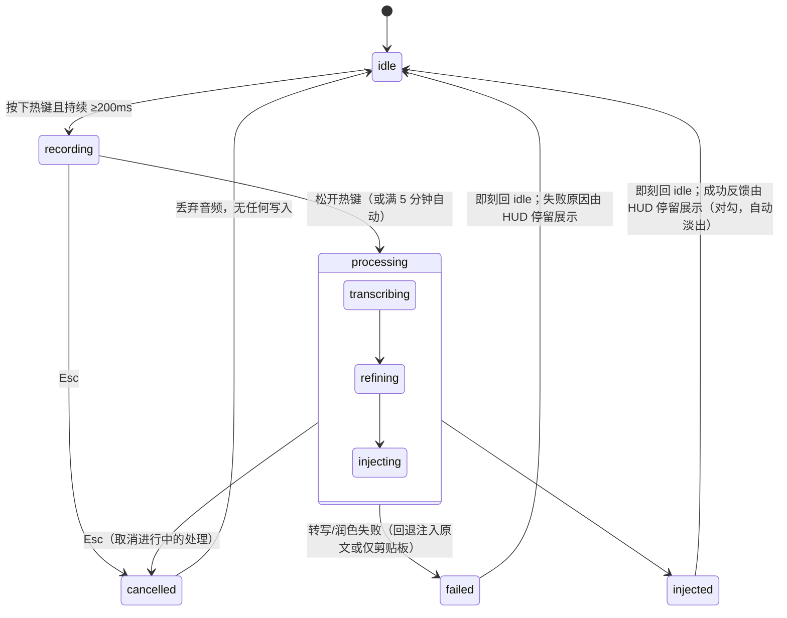
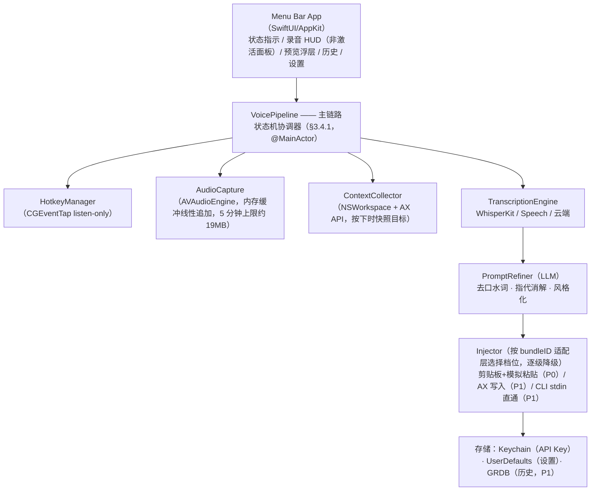
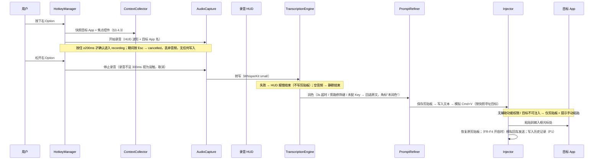

# Voxmit —— 语音驱动 AI 编程工具

## 需求分析与方案说明

| 项目 | 内容 |
|---|---|
| 文档版本 | v0.11（润色 System Prompt 防脑补硬约束） |
| 日期 | 2026-08-19 |
| 目标平台 | macOS |
| 技术路线 | Swift + SwiftUI/AppKit 原生 |
| 状态 | MVP 开发中（Phase 0–4 已实现并验证，见 `PLAN.md`） |

### v0.1 → v0.2 变更记录

- 新增 §3.4「交互定义与状态机」：录音状态机、热键防误触、Esc 取消手势、**注入目标窗口锁定策略**；
- 新增需求编号：FR-B5（Esc 取消，P0）、FR-F5（注入目标锁定与降级，P0）、FR-G5（权限自检页，P0）；明确 FR-F4 自动发送**默认关闭**；
- §3.2 非功能需求新增端到端延迟预算分解表；
- §4.2 各模块细化为「职责 / 接口 / 关键实现 / 边界情况」四要素；新增 §4.2.0 Pipeline 协调器；
- §4.3 时序图补充目标快照、取消与回退分支；
- §4.4 重写为权限矩阵（三权限 × 检测 API × 降级路径）+ 签名公证流水线；
- §4.5 补充 SPM 依赖清单；新增 §4.6 工程结构（目录、Target、Info.plist 键）；
- §5 里程碑补充可勾选验收清单与测量方法；
- §6 新增四项风险（多行粘贴、安全输入阻断、运行中权限撤销、模型下载失败）；
- §7 补充豆包桌面版交互参考（Esc 取消、波形反馈）；
- §8 开放问题逐条补充「建议方案（待确认）」；
- 新增 §9 附录：核心协议草案（Swift）、设置项清单、测试策略。

### v0.2 → v0.3 变更记录（2026-08-17）

- §8 开放问题第 1–4 项经维护者决策确认：LLM 默认 Kimi（Moonshot）端点、用户自备 Key；模型首次启动引导下载；历史记录明文 + 滚动清理；商业形态暂缓定形、代码按可开源组织；
- §4.2.3 模型下载策略、§9.2 `llm.baseURL` 默认值同步为已定方案；
- 产品定名 **Voxmit**（GitHub 查重 0 同名；仓库 https://github.com/scottli139/voxmit，Private），§8 五项开放问题全部关闭。

### v0.3 → v0.4 变更记录（2026-08-18）

- Phase 0–4 实现偏差回写（以实现为准）：§3.4.1 终止态即刻回 idle、反馈停留由 HUD 侧决策与计时；§4.2.1 输入监控引导改为 preflight 检测 + 权限自检页深链（不再用 `CGRequestListenEventAccess()` 主动弹窗）；§9.1 补入 `AudioCapturing` / `ContextCollecting` 协议，`TranscriptionEngine` / `PromptRefining` / `TextInjecting` 增加 `Sendable` 约束（Swift 6 严格并发）；§4.4 补充"无麦克风权限时菜单栏降级录音入口禁用"、event tap 重建提示降为 V1.1 增强；§4.6 工程结构目录树更新为 as-built 现状；
- 文档图示全部 mermaid 化（§3.4.1 / §4.1 / §4.3；§4.6 为文本目录树，仅去除注释列对齐）；
- FR-B2 最小可用版提前落地 MVP（真机动机：右 Option 与微信语音输入快捷键冲突）：§3.1 FR-B2 条目加注记，预设四档即时生效，完整自定义录入仍为 V1.1。

### v0.4 → v0.5 变更记录（2026-08-18）

- 新增 FR-B6（触发源抽象：系统媒体键事件作为 PTT 触发，P1）：固化无线麦发射器按钮调研结论——主流 2.4G 无线麦发射器按钮均为设备本地功能、电脑不可捕获，物理按钮触发走"蓝牙媒体键/模拟键盘"路线，不依赖麦克风厂商配合（详见 §3.1 B 节注记）。

### v0.5 → v0.6 变更记录（2026-08-18）

- Phase 5（本地转写 FR-C1）实现偏差回写，6 处逐项经维护者确认（全部以实现为准）：
  - §4.2.3 模型下载策略：onboarding 引导下载 → 启动即后台自动下载 + 设置页进度/重试可见；自实现 URLSession → WhisperKit 内置下载（底层即 URLSession 后台 session，自带断点续传）；落盘校验 = 目录存在性 + 引擎激活 `loadModels()` 兜底（无逐文件校验）；
  - §4.4 权限矩阵新增第四项：语音识别（可选，Speech 兜底引擎首次使用时由系统弹窗请求，不进 onboarding）；
  - §4.2.6 加注记：注入占位提前升级为剪贴板档（Phase 8 真注入落地前的 interim）；
  - §3.1 FR-C3、§9.2 `asr.customVocabulary` 加注记：设置页"云端"选项暂回落本地路径、词表键存在但暂未接线（均为 P1）。

### v0.6 → v0.7 变更记录（2026-08-18）

- Phase 5 真机验收暴露 huggingface.co 在本网络不可达（被墙）：模型下载新增镜像自动回退（官方 → hf-mirror.com，WhisperKit `endpoint:` 参数原生支持，断点续传跨端点有效）；§4.2.3 下载策略同步，§9.2 新增 `asr.modelRepoEndpoint` 键；
- 维护者提出产品级日志要求（支撑开发排障与用户现场分析）：新增 FR-G6（诊断日志导出，P0，已随 MVP 落地）；§3.2 非功能需求新增"可诊断性"行。

### v0.7 → v0.8 变更记录（2026-08-18）

- §4.2.3 下载策略整体回写为自实现前台下载器。真机确诊链：①WhisperKit 内置下载的 HEAD 元数据强校验与 hf-mirror resolve-cache 缺 Content-Length 的响应不兼容（小文件必挂、大文件正常，错误不含文件名不可定位）；②后台 session 依赖的 nsurlsessiond 并非全环境可用；③tokenizer 依赖另一仓库且激活期联网——被墙环境必挂，随模型落盘后离线激活（真机验证：ANE 首次编译 104s 后激活成功）。另：markInvalid 自愈去除删目录行为（网络原因激活失败不应毁数据，下载器幂等重入可自愈）。
- WhisperKit 转写默认锁定中文（§9.2 新增 `asr.whisperLanguage`，"auto" 恢复自动检测）：短音频自动语言检测易误判英文（真机："喂喂喂123123" → "We we we year three year three"）。

### v0.8 → v0.9 变更记录（2026-08-19）

- §4.2.4 润色超时预算放宽：3s（1.2+0.3+1.5）→ 4.3s（2.0+0.3+2.0）。原因：Moonshot 响应波动 + 冷连接 TLS 握手，3s 预算下超时回退率过高（真机：首试 1219ms 超 1.2s、重试 1562ms 超 1.5s）；决策口径——"润色成功但略慢"优于"快但未润色"。§1.3 延迟预算表同步注记。
- 配套工程措施（不改需求定义）：录音开始时对 LLM 端点做轻量连接预热（共享 URLSession keep-alive 连接池，fire-and-forget，失败静默），降低冷连接占用润色预算的概率。

### v0.9 → v0.10 变更记录（2026-08-19）

- §4.2.4 润色超时预算第二次放宽：4.3s（2.0+0.3+2.0）→ 7.3s（3.5+0.3+3.5）。本机 curl 实测 api.moonshot.cn：DNS 0.66s、TCP 1.30s、TLS 握手完成 2.3~2.7s；冷连接 chat 总 3.8~5.0s；热连接（连接复用）纯服务端处理 1.2~2.9s。预算口径：冷连接首试 3.5s 内握手完成并入池，重试走热连接 2.9s < 3.5s 兜底成功。§1.3 延迟预算表同步。
- 配套修正：连接预热超时 2s → 8s——实测握手需 2.3~2.7s，2s 的预热从未成功（日志实证每次超时），必须大于握手时间才有效。

### v0.10 → v0.11 变更记录（2026-08-19）

- §9.1 润色 System Prompt 模板更新（5 条→6 条）：真机反馈润色脑补——在 Notes（非工程 App）口述一首诗，模型把上下文（App 名/窗口标题）当成操作对象，生成"在 Notes 中打开窗口、创建新笔记"等用户未口述的操作指令。新增三条硬约束：上下文仅供指代消解不得当操作对象/指令来源；严格忠于原意禁止脑补新增操作；非工程口述只做通顺化不强行包装为技术指令。

---

### 1.1 背景

AI 编程工具（Kimi Code、Claude Code、Cursor 等）的交互入口目前以键盘打字为主。实际开发中存在三类低效场景：

- **描述复杂需求时打字慢**：一段包含上下文、约束、期望结果的 Prompt 往往需要数百字，打字成本高；
- **手不在键盘上**：读代码、画架构图、调试硬件时，思路是连续的，切换到打字会打断心流；
- **口语到工程 Prompt 有鸿沟**：随口说出的需求充满"嗯""那个""这个函数"，直接转写后质量差，AI 工具理解效果不佳。

用户已有一个无线麦克风（蓝牙或 2.4G dongle，在 macOS 中表现为标准音频输入设备），希望基于它开发一款软件，打通 Kimi Code 等 AI 开发工具。

### 1.2 产品目标

做一款 **macOS 菜单栏常驻工具**：按住一个键说话，软件完成"录音 → 转写 → 润色成高质量 Prompt → 自动注入当前 AI 开发工具"的完整链路，让语音成为 AI 编程的第一入口。

### 1.3 成功衡量指标

| 指标 | 目标值 | 测量口径 |
|---|---|---|
| 从松手到文字出现在目标输入框的端到端延迟 | ≤ 2 秒（15 秒以内语音，P95） | 连续 20 次实测取 P95，Apple Silicon 机型 |
| 润色后 Prompt 可用率（无需手工修改直接发送） | ≥ 80% | 内部试用 100 条统计 |
| 单次语音输入平均替代打字字数 | ≥ 150 字 | 历史记录统计 |
| 崩溃率 | ≤ 0.1% 会话 | 崩溃日志 / 总会话数 |

延迟预算分解（2 秒端到端的分配，实现时按此压测）：

| 环节 | 预算 | 说明 |
|---|---|---|
| 停止录音 + 音频缓冲落内存 | ≤ 50 ms | 不落盘 |
| 本地转写（15s 音频，WhisperKit small） | ≤ 900 ms | M 系列实测 RTF ≈ 0.05–0.15 |
| 上下文采集 | ≤ 100 ms | 与转写并行，不计入串行预算 |
| LLM 润色（云端，非流式一次性返回） | ≤ 800 ms | 总超时 7.3s（v0.10 放宽，见 §4.2.4），超时回退原文 |
| 注入（剪贴板 + Cmd+V） | ≤ 200 ms | 含剪贴板写入与按键模拟 |
| **合计（串行链路）** | **≈ 1.95 s** | 润色超时回退时最坏 ≈ 4s，HUD 需有状态提示 |

---

## 2. 目标用户与核心场景

### 2.1 目标用户

- 日常使用 Kimi Code / Claude Code / Cursor 等 AI 编程工具的开发者；
- macOS 用户，拥有外接/无线麦克风；
- 注重效率、愿意尝试新交互方式的重度 AI 用户。

### 2.2 核心使用场景

| 编号 | 场景 | 描述 |
|---|---|---|
| S1 | 语音写 Prompt | 按住热键说出需求，自动转写、润色后填入 AI 工具输入框 |
| S2 | 上下文感知输入 | 在编辑器中选中一段代码后说话，"这个函数为什么报错"自动带上所选代码与文件路径 |
| S3 | 免提编程流 | 手离开键盘（看文档/白板/调试设备）时纯语音驱动 AI 工具 |
| S4 | 口述需求转 Spec | 讲述一段产品想法，整理为结构化需求文档，再喂给 AI 生成代码 |
| S5 | 语音指令 | "运行测试""提交当前改动"等高频操作语音触发（V2） |

---

## 3. 需求分析

### 3.1 功能性需求

优先级定义：**P0** = MVP 必须；**P1** = V1.1；**P2** = V2 及以后。标注「v0.2 新增」的编号为本次评审补充。

#### A. 音频采集

| 编号 | 需求 | 优先级 |
|---|---|---|
| FR-A1 | 从系统默认/用户指定的音频输入设备采集音频，自动识别无线麦克风接入与断开 | P0 |
| FR-A2 | 录音过程中显示实时音量反馈（菜单栏波形/电平） | P0 |
| FR-A3 | 单次录音最长 5 分钟，超时自动结束（按"松手"流程继续处理已录部分）并提示 | P0 |
| FR-A4 | 录音开始/结束提示音（可在设置中关闭） | P1 |

#### B. 触发方式

| 编号 | 需求 | 优先级 |
|---|---|---|
| FR-B1 | 按住说话（Push-to-Talk）：按住全局热键（默认右 Option 键）开始录音，松开结束；短按（< 200ms）视为普通按键忽略，防止误触 | P0 |
| FR-B2 | 热键可自定义（修饰键、组合键）；MVP 已落地预设四档（右 Option / 右 Command / 右 Shift / Fn），完整自定义录入仍为 V1.1 | P1（预设四档已提前落地 MVP） |
| FR-B3 | 点按切换模式（按一下开始、再按一下结束），适合长口述 | P1 |
| FR-B4 | 唤醒词模式（"Hey Kimi"等） | P2 |
| FR-B5 | 取消手势：录音中按 Esc 放弃本次录音；预览浮层中按 Esc 取消注入（v0.2 新增） | P0 |
| FR-B6 | 触发源抽象：除键盘热键外，支持捕获系统媒体键事件（蓝牙翻页笔/遥控器等模拟的播放/暂停键）作为 PTT 触发（v0.5 新增，调研结论见下方注记） | P1 |

注（FR-B6，2026-08 调研验证）：

- 主流 2.4G 无线麦（DJI Mic 系列、Hollyland Lark 系列、RØDE Wireless GO 系列）发射器按钮均为设备本地功能（静音/内录/降噪/配对），信号经私有 2.4G 链路只到接收器；接收器在 macOS 仅枚举为 USB Audio Class 声卡，按键不产生任何电脑可捕获事件——发射器按钮路线不可行，物理触发不依赖麦克风厂商配合。
- DJI Mic 2/3/Mini 发射器蓝牙已支持直连电脑（DJI 官方 2026-08 支持页确认；早期固件仅限 Osmo 设备与手机），但直连后仅表现为 HFP 蓝牙麦克风，按键仍是本地功能，同样不可捕获。
- 可行物理触发源：蓝牙翻页笔/遥控器等模拟键盘键或 AVRCP 媒体键，macOS 上以 `.systemDefined` 事件监控 / CGEventTap listen-only 捕获，权限要求与现有键盘热键一致（输入监控）。listen-only tap 不能吞事件，宜选播放/暂停等空闲时无副作用的键值；AirPods 按压被系统媒体层接管，第三方捕获依赖私有 API，不作为目标触发源。
- 现有 VoicePipeline 触发入口（`handleHotkeyDown` / `handleHotkeyUp`）与事件源解耦，本需求落地时仅需新增媒体键事件源，不动 Pipeline；若触发源与采集设备同为蓝牙，需注意蓝牙麦休眠预热（按下后 2–5 秒才出声）。

#### C. 语音转写

| 编号 | 需求 | 优先级 |
|---|---|---|
| FR-C1 | 本地端侧转写（默认），支持中英文混合识别 | P0 |
| FR-C2 | 转写结果实时流式显示（边说边出字） | P1 |
| FR-C3 | 可选云端转写引擎，长句与专业术语场景可切换（v0.6 注记：设置页"云端"选项已存在，选中暂回落本地路径，P1 实现时接通） | P1 |
| FR-C4 | 自定义词表：项目名、库名、人名等热词增强 | P1 |

#### D. Prompt 润色

| 编号 | 需求 | 优先级 |
|---|---|---|
| FR-D1 | LLM 改写：去口水词、补全句式、规范技术表述，输出工程化 Prompt | P0 |
| FR-D2 | 指代消解：结合上下文把"这个文件""刚才的报错"替换为实际内容 | P1 |
| FR-D3 | 润色风格可配置（简洁/详细/直接执行指令） | P1 |
| FR-D4 | 旁路开关：按住另一修饰键（默认右 Option + Shift）可跳过润色，直接注入原始转写 | P0 |

#### E. 上下文感知

| 编号 | 需求 | 优先级 |
|---|---|---|
| FR-E1 | 读取前台 App 名称与类型（终端 / 编辑器 / 浏览器等） | P0 |
| FR-E2 | 通过 Accessibility API 读取当前选中文本、光标位置 | P1 |
| FR-E3 | 终端场景识别正在运行的 AI CLI（Kimi Code 等），读取其会话状态 | P1 |
| FR-E4 | 抓取剪贴板、git 状态等作为补充上下文 | P2 |

#### F. 结果注入

| 编号 | 需求 | 优先级 |
|---|---|---|
| FR-F1 | 通用注入：写入剪贴板并模拟 Cmd+V 粘贴到焦点输入框（光标处插入，不覆盖已有内容） | P0 |
| FR-F2 | 终端/CLI 直通：检测到 Kimi Code 等 CLI 时直接写入其 stdin 或以参数调用 | P1 |
| FR-F3 | 注入前预览浮层：可编辑后回车确认发送 | P1 |
| FR-F4 | 自动发送（粘贴后回车）可配置开关，**默认关闭**；开启后粘贴完成延迟约 150ms 模拟回车 | P0 |
| FR-F5 | 注入目标锁定：热键按下时快照前台 App 与焦点控件，注入按快照寻址，失败时降级为"仅剪贴板 + 提示手动粘贴"（v0.2 新增） | P0 |

#### G. 应用本体

| 编号 | 需求 | 优先级 |
|---|---|---|
| FR-G1 | 菜单栏常驻，无主窗口，开机自启动可选 | P0 |
| FR-G2 | 历史记录：最近 N 条语音、转写、润色结果，可重新注入 | P1 |
| FR-G3 | 设置界面：热键、麦克风选择、转写引擎、LLM 配置、注入行为 | P0 |
| FR-G4 | 语音播报 AI 回复（TTS，形成双向语音闭环） | P2 |
| FR-G5 | 权限自检页：三项权限状态总览、逐项引导开启、一键跳转系统设置（v0.2 新增） | P0 |
| FR-G6 | 诊断日志：关键事件经 os_log 分类记录（不含凭据与文本本体），同时持久化到本地日志文件（`~/Library/Application Support/Voxmit/Logs/voxmit-yyyy-MM-dd.log`，按日命名，保留最近 7 个且 ≤20MB）；设置页一键导出诊断文件（环境头 + 权限快照 + 近期日志），用于用户现场排障（v0.7 新增，已随 MVP 落地） | P0 |

#### H. AI 工具深度集成

| 编号 | 需求 | 优先级 |
|---|---|---|
| FR-H1 | 提供 MCP Server，将"听取一段语音输入"暴露为 MCP 工具，供支持 MCP 的 AI Agent 主动调用 | P2 |
| FR-H2 | 语音指令集：运行测试、git 提交、切换分支等 | P2 |

### 3.2 非功能性需求

| 类别 | 需求 |
|---|---|
| 性能 | 端到端延迟 ≤ 2 秒（P95，预算分解见 §1.3）；常驻内存 ≤ 300 MB（本地模型加载后 ≤ 1.5 GB）；CPU 空闲占用 ≈ 0 |
| 隐私 | 默认全本地处理（转写端侧完成）；润色调云端 LLM 时首次启用明确告知且可全局关闭；录音数据仅存内存，不落盘 |
| 权限 | 麦克风（必需）、输入监控（全局热键）、辅助功能（模拟按键注入与上下文感知）；权限矩阵见 §4.4 |
| 兼容性 | macOS 14 Sonoma 及以上；优先 Apple Silicon，Intel 机型降级到云端转写 |
| 可靠性 | 热键冲突检测与提示；录音中断兜底（松手即出已有部分）；event tap 被系统禁用后自动恢复；异常不丢历史记录 |
| 可诊断性 | 关键事件（状态机转换、外部交互成败、用户操作）经 os_log 分类打点；设置页可导出诊断日志（FR-G6）；日志不落凭据与转写/润色文本本体 |
| 可分发性 | 开发者证书签名 + Apple 公证（Notarization）；Sparkle 自动更新（V1.1 接入） |

### 3.3 产品边界（本期不做）

- 不做 Windows / Linux 版本（架构上预留可能）；
- 不做手机端；
- 不做自研语音识别模型（全部复用现成引擎）；
- 不做团队协作与账号体系（V1 为纯单机工具）；
- 不替代 AI 编程工具本身，只做"输入层增强"。

### 3.4 交互定义与状态机（v0.2 新增）

本节是主链路交互的唯一事实来源，UI 与各模块按此实现。

#### 3.4.1 主状态机



任意有效进行状态下按 Esc → cancelled → idle（丢弃音频，无任何写入）；终止态停留时长见下。

- `processing` 子状态依次为 `transcribing → refining → injecting`，HUD 同步显示当前阶段；
- 终止态（`injected` / `failed` / `cancelled`）在状态机内**即刻回 `idle`**；反馈停留时长由 HUD 侧决策与计时（成功 0.8s / 未润色 1.2s / 手动粘贴 2.5s / 失败 2.5s，取消立即消失），不占用状态机迁移；
- 润色失败/超时不阻断链路：回退注入原始转写，HUD 角标提示"未润色"；
- 转写失败（无可用引擎、音频为空）则进入 `failed`：HUD 提示原因，不写剪贴板。

#### 3.4.2 热键语义（默认右 Option）

- `flagsChanged` 事件中 keyCode = 右 Option（0x3D）且 Alternate flag 置位 → 视为"按下"；flag 清除 → 视为"松开"；
- 按下后 **200ms 内松开：整次忽略**（防止切输入法等场景误触）；进入 `recording` 后 **录音不足 300ms 即松开：按误触取消**；
- 按住期间其他修饰键的按下/松开不影响录音状态；
- 旁路修饰键（FR-D4）：按住右 Option 的同时 Shift 处于按下状态，则本次跳过润色；
- 点按切换模式（FR-B3，P1）：从设置开启后，按一下进入录音，再按一下或 Esc 结束。

#### 3.4.3 注入目标窗口锁定（FR-F5 的交互定义）

核心原则：**不做窗口选择，文字永远进入"按下热键那一刻用户正在使用的 App"**。

- **按下时快照**：热键 keyDown 瞬间记录 `NSWorkspace.frontmostApplication`（PID、bundleID、窗口标题）与 AX 焦点控件引用；
- **本工具全程不抢焦点**：App 为菜单栏 Agent（`LSUIElement = true`，activation policy = `.accessory`）；录音 HUD 与预览浮层使用 `NSPanel` + `.nonactivatingPanel`，并设 `collectionBehavior = [.canJoinAllSpaces, .fullScreenAuxiliary]`，保证全屏终端中也可见；
- **录音期间用户切换了前台 App**：以**松手时**的前台 App 重新校验目标（符合当下意图），HUD 上实时显示当前目标 App 名；
- **目标不可注入**（焦点控件不可编辑、AX 读取失败、前台为桌面等）：降级为仅写剪贴板，HUD 提示"已复制，Cmd+V 手动粘贴"；
- 注入行为是**光标处插入**（Cmd+V 天然如此；AX 写入用 `AXSelectedText`），绝不覆盖输入框已有内容。

---

## 4. 技术方案

### 4.1 总体架构



### 4.2 模块设计

各模块均定义协议（草案见 §9.1），实现可替换、可 mock，单测不依赖系统权限。

#### 4.2.0 VoicePipeline —— 主链路协调器（v0.2 新增）

- **职责**：驱动 §3.4.1 状态机，串联 Hotkey → Audio → Context → Transcription → Refiner → Injector；所有状态暴露在 `@MainActor ObservableObject` 上供 UI 订阅；
- **接口**：`handleHotkeyDown()` / `handleHotkeyUp()` / `cancel()`（Esc 与误触统一走 cancel）；
- **时序判定集中在此层**：200ms 防误触、300ms 最短录音、5 分钟上限、旁路修饰键判定；HotkeyManager 只上报原始按下/松开事件；
- **并发**：录音期间 ContextCollector 快照已在 keyDown 时同步完成；转写与润色串行 await，全程可取消（Task cancellation，Esc 时取消进行中的 Task）。

#### 4.2.1 HotkeyManager —— 全局热键

- **职责**：全局热键监听，产出"按下/松开"语义事件；
- **关键实现**：
  - `CGEvent.tapCreate` 建立 **listen-only** tap（`.cgSessionEventTap`），只监听 `flagsChanged`，事件放行不拦截——因此只需"输入监控"权限，不需要辅助功能；
  - 右 Option 判定：事件 keyCode == 0x3D（`kVK_RightOption`）且 flags 新置位 `.maskAlternate` → 按下；flag 清除 → 松开；
  - 权限检测 `CGPreflightListenEventAccess()`（preflight，不触发弹窗）；无权限时不创建 tap，经权限自检页（FR-G5）深链引导用户到系统设置手动开启；权限补齐后自动建 tap 生效，运行中被撤销则自动停止（§4.4 降级）；
  - 健壮性：监听 `tapDisabledByTimeout` / `tapDisabledByUserInput`，收到后 `CGEvent.tapEnable` 恢复；RunLoop source 失效时整体重建 tap；
- **边界情况**：
  - 安全输入（密码框聚焦，`EnableSecureEventInput`）期间系统阻断事件监听，热键暂时失效属系统行为：不报错、不尝试绕过，设置页 FAQ 说明；
  - 热键冲突（输入法切换、Raycast 等占用右 Option）：权限自检页提供"按一下试试"实测区，以用户实测为准；
- 热键自定义（FR-B2，P1）：存储 keyCode + 修饰键组合，普通组合键改监听 `keyDown`。

#### 4.2.2 AudioCapture —— 音频采集

- **职责**：采集音频，输出 16kHz 单声道 Float32 PCM 样本；提供实时电平；
- **关键实现**：
  - `AVAudioEngine` + `inputNode.installTap`；硬件格式（通常 48kHz 立体声）经 `AVAudioConverter` 重采样为 16kHz mono Float32，追加到**内存缓冲**（`[Float]`，不落盘，满足隐私要求）；
  - 电平：每 50ms 对最新帧计算 RMS → dBFS，发布给 HUD 波形；
  - 设备热切换：监听 `AVAudioEngineConfigurationChangeNotification`，重建 engine 并**继续录制，已录部分保留**；用户指定设备断开时回落系统默认并 HUD 提示；
  - 5 分钟硬上限：计时器到点通知 Pipeline 走"松手"流程，HUD 提示"已达最长录音时长"；
- **边界情况**：
  - 无输入设备 / 麦克风权限被拒 → 抛错，Pipeline 进入 `failed` 并引导权限；
  - 蓝牙麦连接协商延迟导致开头百毫秒空数据：转写前裁剪静音前缀；
- `Info.plist` 声明 `NSMicrophoneUsageDescription`（"用于按住热键进行语音输入"）。

#### 4.2.3 TranscriptionEngine —— 转写

- **职责**：PCM → 文本，引擎可插拔、运行时切换；
- **引擎矩阵**：

| 引擎 | 定位 | 模型体积 | 说明 |
|---|---|---|---|
| **WhisperKit small**（默认） | 本地主力 | ~500 MB | Core ML，M 系列 15s 音频 < 1s；中英混合可用 |
| WhisperKit tiny / large-v3 | 可选档位 | ~75 MB / ~1.5–3 GB | tiny 快而糙、large 准而慢，设置中切换 |
| Speech 框架 | 本地备选/兜底 | 0（系统） | 模型未下载完成前的过渡；`SFSpeechRecognizer` 端侧识别（v0.7 注记：依赖系统"听写"开启且已添加对应语言的听写资产，与 TCC 语音识别授权相互独立；locale 默认 zh-CN，可经 `asr.speechLocale` 覆盖，见 §9.2） |
| 云端 ASR | 可选增强 | 0 | Intel 机型默认；需用户显式开启 |

- **模型下载策略**（§8-2 已决策；v0.8 整体回写）：启动即后台自动下载 small（不打断首启流程），设置页可见下载进度与失败重试；下载器为**自实现前台下载器**（v0.8 起弃用 WhisperKit 内置下载——其 HEAD 元数据强校验与镜像 resolve-cache 缺 Content-Length 的响应不兼容且错误不可定位，后台 session 依赖的 nsurlsessiond 亦非全环境可用）：tree API 取文件清单（大小取清单 size 字段，不依赖 HEAD）→ 逐文件前台 GET，`.partial` + Range 断点续传，完成大小校验后原子移动落盘；tokenizer（tokenizer.json / tokenizer_config.json，`openai/whisper-<variant>` 仓库）随模型同下载并放模型目录根（离线激活必要条件）；落盘校验分层：完整产物集校验（config.json + 三件 .mlmodelc），引擎激活 `loadModels()` 兜底；模型落盘 `~/Library/Application Support/Voxmit/Models`；下载完成前自动以 Speech 框架兜底；官方端点（huggingface.co）不可达时自动回退 hf-mirror.com 镜像，端点链可经 `asr.modelRepoEndpoint` 强制指定（§9.2）；Intel 机型跳过下载、直接引导云端 ASR；
- 自定义词表（FR-C4，P1）：经 WhisperKit 的 initialPrompt/prefill 机制注入热词；
- **边界情况**：
  - 空音频 / 纯静音 → 返回空串，Pipeline 按误触静默结束（不报错、不注入）；
  - 模型文件校验失败 → 提示重新下载。

#### 4.2.4 PromptRefiner —— Prompt 润色

- **职责**：原始转写 + 上下文 → 工程化 Prompt；任何异常不得阻断主链路；
- **关键实现**：
  - OpenAI 兼容 `chat/completions` 接口；baseURL / model / API Key 可配置（默认建议值见 §8-1）；Key 存 Keychain（`kSecClassGenericPassword`，`kSecAttrAccessibleAfterFirstUnlockThisDeviceOnly`），**禁止写入 UserDefaults 与日志**；
  - 上下文组装：前台 App 名、窗口标题、选区文本（截断 ≤ 2KB）作为 user message 补充块；System prompt 模板见 §9.1；
  - 超时：总预算 7.3s（首次尝试 3.5s + 退避 300ms + 重试 3.5s；2026-08-19 第二次放宽——本机实测 api.moonshot.cn：TLS 握手 2.3~2.7s、冷连接 chat 3.8~5.0s、热连接纯服务端处理 1.2~2.9s，冷连接首试 3.5s 内握手完成并入池、重试走热连接 2.9s < 3.5s 兜底成功）；超时/失败/未配置 Key 均回退原文，返回值带"是否润色"标记供 HUD 角标展示；
  - 旁路（FR-D4）：按住右 Option + Shift 本次跳过润色；设置中 `refineEnabled = false` 全局跳过；
- **隐私**：首次启用润色时弹一次说明（"转写文本将发送至您配置的 LLM 服务商"），可随时关闭；
- **成本**：单次调用输入 < 1k tokens、输出 < 500 tokens。

#### 4.2.5 ContextCollector —— 上下文感知

- **职责**：采集并打包结构化上下文 `VoiceContext`（§9.1），供 Refiner 与 Injector 共用；
- **采集时机**：热键 keyDown 快照 + 松手时校验（§3.4.3）；
- **P0**：`NSWorkspace.frontmostApplication` → PID、bundleID、名称；AX `AXFocusedWindow` → 窗口标题；App 分类按 bundleID 适配表（`com.apple.Terminal`、`com.googlecode.iterm2`、`com.microsoft.VSCode` 等 → 终端/编辑器/浏览器/其他）；
- **P1**：`AXFocusedUIElement` → `AXSelectedText` / `AXValue`（截断）；终端 AI CLI 识别（窗口标题 + 进程名匹配 kimi / claude 等）；
- **降级矩阵**：无 AX 权限 → 仅 App 名（NSWorkspace 无需权限）；App 无焦点窗口 → 仅 bundleID；全部失败 → "无上下文"模式，润色仅做句式整理。

> 实现状态（2026-08-19 已落地）：`Modules/Context/RealContextCollector.swift`（SystemWorkspace 协议隔离 NSWorkspace+AX）+ `AppCategoryMapper` 纯表；松手时前台必二次快照、切换打 NOTICE 并以松手时前台为准；「无上下文」时润色省略上下文块。§9.1 `TargetSnapshot` 字段（pid/bundleID/appName/windowTitle/capturedAt）与实现一致，无需变更。

#### 4.2.6 Injector —— 结果注入

- **职责**：把最终文本注入目标 App 输入框；按适配层选档，逐级降级；

| 方式 | 原理 | 适用 | 优先级 |
|---|---|---|---|
| 剪贴板 + 模拟 Cmd+V | `NSPasteboard` 写入，`CGEventPost` 发帖按键 | 所有 App，通用兜底 | P0 |
| AX 直接写入 | `AXUIElement` 设 `AXSelectedText` 光标处插入 | 编辑器、终端，体验好 | P1 |
| CLI stdin 直通 | 检测 Kimi Code 等进程，直接写 stdin | 终端 AI CLI，集成最深 | P1 |

- **P0 流程（顺序严格）**：
  1. 快照 `NSPasteboard.general` 当前 items；
  2. 写入目标文本，记录 `changeCount`；
  3. `CGEventPost` 模拟 Cmd+V（**需辅助功能权限**，非输入监控）；
  4. 延迟 ~300ms（或轮询 `changeCount` 确认目标 App 已读取）后恢复原剪贴板内容；
  5. FR-F4 开启时：再延迟 ~150ms 模拟 Return；
- **关键细节**：
  - 适配层：bundleID → `{注入档位, 是否折叠换行, 发送键}` 配置表，内置 Terminal / iTerm2 / VS Code / Cursor 默认值，设置中可覆盖；
  - **多行文本**：终端 TUI 中换行可能被解释为多次提交——对 CLI 目标默认把换行折叠为空格；
  - **AX 写入必须用 `kAXSelectedTextAttribute`**（光标处插入），禁止设 `AXValue`（会清空输入框已有内容）；
- **降级与竞争**：
  - 无辅助功能权限 / 目标焦点不可编辑 / 目标 App 注入瞬间退出 → 仅剪贴板 + HUD 提示"已复制，Cmd+V 手动粘贴"；
  - 恢复剪贴板前检测到 `changeCount` 又被改变（用户复制了新内容）→ 放弃恢复，不覆盖用户内容；
  - （v0.6 注记）Phase 8 真注入落地前，注入占位实现为剪贴板档 interim：仅写剪贴板并返回 clipboardOnly，HUD 提示"已复制，Cmd+V 手动粘贴"——使 Phase 5–7 真机即可验证文字产出。

#### 4.2.7 MCP Server（V2）

- 以独立进程/内嵌 HTTP Server 提供 MCP 协议服务；
- 暴露 `listen_voice` 工具：AI Agent 调用后，用户端弹出录音提示，语音内容作为工具结果返回；
- 支持 AI 反问场景："需求有歧义 → Agent 主动调用 → 用户语音回答"。

### 4.3 关键链路时序（P0 主链路）



目标：松手到上屏 ≤ 2 秒（预算分解见 §1.3）。

### 4.4 权限矩阵与分发（v0.2 重写）

**权限矩阵**——检测与引导分离，实现时严格对照：

| 权限 | 解锁功能 | 检测 API | 缺失时降级 |
|---|---|---|---|
| 麦克风 | 录音（硬阻塞） | `AVCaptureDevice.authorizationStatus(for: .audio)` | 无法录音，onboarding 强制引导；菜单栏降级录音入口同步禁用（无麦克风录音无意义） |
| 输入监控 | 全局热键（CGEventTap listen-only） | `CGPreflightListenEventAccess()` | 降级：菜单栏点击开始/停止录音 |
| 辅助功能 | 模拟 Cmd+V/回车、AX 上下文 | `AXIsProcessTrusted()` | 降级：仅剪贴板 + 提示手动粘贴；无 AX 上下文 |
| 语音识别（v0.6 新增） | Speech 兜底引擎（模型未就绪时的过渡转写） | `SFSpeechRecognizer.authorizationStatus()` | 可选权限，不进 onboarding：Speech 兜底首次使用时由系统弹窗请求；拒绝则兜底转写失败、HUD 显示原因，WhisperKit 就绪后不受影响 |

> 常见误区：模拟按键（`CGEventPost`）需要的是**辅助功能**权限；listen-only 事件监听需要的是**输入监控**权限。两者缺一不可互相替代。

- **引导流程**：首次启动进入权限自检页（FR-G5），按"麦克风 → 输入监控 → 辅助功能"顺序逐项引导；每项提供"打开系统设置"深链接与实时状态刷新；前两项为必需，辅助功能可跳过（降级运行）；
- **运行中权限被撤销**：event tap 失效自动重建（P0 必需）；重建提示降为 V1.1 增强（提示通道走录音 HUD 提示条）；`AXIsProcessTrusted` 每次注入前检查，失效即降级；
- **签名与公证**：Developer ID Application 签名 → `notarytool` 公证 → `stapler` 钉票 → DMG 分发；
- **沙盒取舍**：启用 App Sandbox 会限制 CGEventTap 与 AX 能力，本工具**关闭沙盒、不走 Mac App Store**，走官网分发；开启 Hardened Runtime 以满足公证要求；
- **自动更新**：Sparkle 2.x（V1.1 接入，EdDSA 签名校验，appcast 托管官网）。

### 4.5 技术选型与依赖

| 层 | 选型 | 理由 |
|---|---|---|
| 语言/UI | Swift 6 + SwiftUI（AppKit 互操作） | 音频、热键、AX 均为一等公民；菜单栏 App 形态成熟 |
| 音频 | AVAudioEngine | 系统原生，设备热切换支持好 |
| 全局热键 | CGEventTap（listen-only） | 支持修饰键按住/松开语义；权限要求最低 |
| 本地 ASR | WhisperKit（whisper.cpp Core ML） | Apple Silicon 性能优秀，开源，可流式 |
| 云端 ASR | 可插拔（兼容多家） | 长音频增强，可选 |
| LLM 润色 | OpenAI 兼容协议（可配 Kimi/Moonshot） | 用户可自选，Keychain 存 Key |
| 注入 | NSPasteboard + CGEvent / AXUIElement | 通用 + 高体验双通道 |
| 存储 | GRDB（SQLite，P1）+ UserDefaults + Keychain | 历史 / 设置 / 密钥各归其位 |
| 更新 | Sparkle 2.x（V1.1） | macOS 事实标准 |
| 参考实现 | VoiceInk（开源 Swift 同类工具） | 架构可直接借鉴 |

**SPM 依赖清单**（建工程时接入，版本取实现时最新稳定版）：

| 依赖 | 用途 | 接入时机 |
|---|---|---|
| `argmaxinc/WhisperKit` | 本地转写 | MVP |
| `groue/GRDB.swift` | 历史记录 | V1.1 |
| `sparkle-project/Sparkle` | 自动更新 | V1.1 |
| —（不引第三方热键库） | 修饰键-only 的按住语义需自行实现 CGEventTap | — |

### 4.6 工程结构（v0.2 新增）

Xcode 工程：macOS App 模板，Swift 6，deployment target **macOS 14.0**，单一 App Target + 单测 Target：

```
Voxmit.xcodeproj  # objectVersion 70，文件系统同步分组（新增源码免改 pbxproj）
Voxmit/
├── VoxmitApp.swift  # @main；MenuBarExtra + Settings 场景
├── VoxmitAppDelegate.swift  # App 级组合根：依赖创建与事件接线
├── Info.plist  # LSUIElement、NSMicrophoneUsageDescription
├── Pipeline/
│   ├── Models.swift  # §9.1 契约 + 状态/快照/上下文/注入报告
│   ├── VoicePipeline.swift  # 状态机协调器（§4.2.0）
│   ├── PipelineClock.swift  # 时钟协议（生产/测试时间源）
│   └── PlaceholderServices.swift  # 下游 no-op 占位（随对应模块 Phase 逐个退役）
├── Modules/
│   ├── Permissions/PermissionManager.swift  # 权限检测与引导（FR-G5，§4.4）
│   ├── Hotkey/HotkeyManager.swift  # 全局热键（§4.2.1）
│   ├── Audio/AudioCapture.swift  # 音频采集（§4.2.2，engine 与系统交互）
│   ├── Audio/AudioProcessing.swift  # 音频纯逻辑（电平/静音裁剪/重采样/设备决策）
│   └── Storage/SettingsStore.swift + KeychainHelper.swift  # UserDefaults 设置 + Keychain 密钥
└── UI/
    ├── SettingsView.swift  # 设置页（§9.2 设置项）
    ├── PermissionOnboardingView.swift + PermissionOnboardingWindowController.swift  # 权限自检页（FR-G5）
    └── RecordingHUD.swift  # 非激活 NSPanel：波形 + 目标 App + 阶段状态与反馈
VoxmitTests/  # 协议 mock + 核心逻辑单测（§9.3）
```

`Modules/Transcription|Refiner|Context|Injector` 子目录、`UI/PreviewPanel.swift` / `HistoryView.swift`（P1）、`Resources/`（图标、提示音、Localizable，zh-Hans 优先）随对应 Phase 建立。

**Info.plist / 构建设置关键项**：

- `LSUIElement = YES`：菜单栏 Agent，无 Dock 图标；
- `NSMicrophoneUsageDescription`：麦克风权限文案；
- 输入监控与辅助功能**无 plist 声明**，由 TCC 在首次调用相应 API 时记录；
- 不启用 App Sandbox entitlement；启用 Hardened Runtime；
- 开机自启（FR-G1）：`SMAppService.mainApp`（macOS 13+）。

---

## 5. 里程碑计划

### MVP（第 1–2 周）：跑通主链路

实现范围（对应 P0 需求编号）：

- [ ] Xcode 工程骨架（§4.6）：MenuBarExtra 菜单栏图标 + 设置页（麦克风、LLM 配置、注入行为）
- [ ] 权限自检页（FR-G5）：三权限状态 + 引导跳转
- [ ] 右 Option 按住说话（FR-B1，含 200ms 防误触 / 300ms 误触取消）+ Esc 取消（FR-B5）
- [ ] 录音 HUD：实时波形（FR-A2）+ 目标 App 名 + 状态显示，非激活面板不抢焦点
- [ ] WhisperKit small 模型下载与本地转写（FR-C1）
- [ ] LLM 润色（FR-D1）：3s 超时回退 + 旁路修饰键（FR-D4）+ 未配 Key 直出
- [ ] 目标快照与剪贴板 + Cmd+V 注入（FR-F1 / FR-F5）+ 剪贴板恢复
- [ ] 自动发送开关（FR-F4，默认关）

**验收标准**：在终端运行的 Kimi Code 中，按住说话 → 松手 2 秒内（P95，20 次实测）润色后的 Prompt 出现在输入框光标处，不覆盖已有输入；可配置自动发送；三项权限缺失时的降级路径各走通一次。

### V1.1（第 3–4 周）：上下文与体验

- AX 上下文感知（FR-E2/E3）：选区代码、文件路径自动带入 Prompt；指代消解（FR-D2）；
- 流式转写（FR-C2，边说边出字）；AX 写入注入档；
- 注入前预览浮层（FR-F3）；点按切换模式（FR-B3）；热键自定义（FR-B2）；提示音（FR-A4）；
- 历史记录面板（FR-G2，GRDB）；自定义词表（FR-C4）；润色风格配置（FR-D3）；
- Sparkle 自动更新接入。

### V2（第 5–8 周）：深度集成

- CLI stdin 直通（FR-F2，Kimi Code 专项适配）；
- MCP Server（FR-H1，`listen_voice` 工具）；
- 语音指令集（FR-H2：测试、git 操作）；
- AI 回复 TTS 播报（FR-G4），形成双向语音闭环。

---

## 6. 风险与应对

| 风险 | 影响 | 应对 |
|---|---|---|
| 辅助功能/输入监控权限被拒 | 上下文感知与热键失效 | 权限自检页 + 降级模式（菜单栏点击录音 / 仅剪贴板注入） |
| 本地转写质量不足（口音、术语） | 润色压力大、可用率下降 | 自定义词表 + 云端 ASR 切换 + LLM 纠错兜底 |
| 无线麦延迟/断连 | 录音丢失 | 设备热切换监听 + 断连即时提示 + 已录部分保留可恢复 |
| LLM 润色延迟不可控 | 端到端延迟超标 | 超时 3s 回退原文；本地小模型润色备选 |
| 各 AI 工具输入框差异 | 注入失败 | 注入适配层按 App 配置化；失败时仅进剪贴板并提示手动粘贴 |
| 多行文本在 CLI 被逐行提交（v0.2 新增） | 误执行命令 | 适配层对 CLI 目标默认折叠换行为空格；实测矩阵覆盖 |
| 安全输入阻断热键（v0.2 新增） | 密码框聚焦时按热键无反应 | 系统行为，不绕过；设置页 FAQ 说明 |
| 运行中权限被用户撤销（v0.2 新增） | 热键/注入静默失效 | event tap 自动重建 + 注入前检查 + 自检页状态刷新提示 |
| 模型下载失败/磁盘不足（v0.2 新增） | 本地转写不可用 | 断点续传 + 落盘校验 + Speech 框架兜底 + 设置页重试入口 |
| macOS 系统 API 变更 | 升级后功能异常 | 关键 API 封装隔离 + 版本兼容测试 |

---

## 7. 竞品与参考

| 产品 | 借鉴点 |
|---|---|
| Wispr Flow | 按住右 Option 说话的交互范式、跨 App 通用注入 |
| Superwhisper | 本地 whisper 模型管理、模式化润色 |
| VoiceInk（开源） | Swift 实现的整体架构，可直接阅读源码 |
| 豆包桌面版 | Push-to-Talk 录音条交互：实时波形、"松手发送，按 Esc 取消"文案；但其为应用内闭环，全局热键/跨 App 注入/权限降级均不涉及 |
| 各类 AI IDE 语音插件 | 上下文感知的差异化方向 |

**差异化定位**：竞品做"通用语音输入"，本产品做"面向 AI 编程的语音入口"——上下文感知（选区代码、文件路径、CLI 状态）+ Prompt 工程化润色 + 与 Kimi Code 等工具的 CLI/MCP 深度集成，是核心壁垒。

---

## 8. 开放问题与决策记录

> 第 1–4 项已于 2026-08-17 经维护者决策确认（即原 v0.2 建议方案全部采纳）；第 5 项已于同日定名 Voxmit。

1. **LLM 润色默认接哪家？是否需要内置免费额度？** ✅ 已决策
   决定：OpenAI 兼容协议，默认 endpoint 指向 Kimi（Moonshot）；MVP 阶段用户自备 Key、不内置额度；内置额度与商业形态（问题 4）绑定，V2 前再议。
2. **本地模型（约 0.5–1.5 GB）下载策略？** ✅ 已决策
   决定：首次启动 onboarding 引导下载 small（约 500 MB），后台下载 + 断点续传 + 校验；完成前 Speech 框架兜底；Intel 机型跳过下载直接引导云端 ASR。
3. **历史记录是否涉及敏感信息，是否需要自动过期/加密？** ✅ 已决策
   决定：P1 阶段明文 SQLite + 30 天或 500 条滚动清理 + 设置页一键清空；加密（SQLCipher 或 Keychain 密钥）列为 P2 增强。
4. **商业形态：开源 + Pro 订阅，还是闭源买断？** ✅ 已决策（暂缓定形）
   决定：暂不定形，代码结构按可开源组织（无硬编码密钥、模块协议隔离），不阻塞 MVP；影响 MCP Server 开放程度，V2 启动前必须最终拍板。
5. **产品命名与品牌方向。** ✅ 已决策
   决定：定名 **Voxmit**（2026-08-17；GitHub 全站查重 0 同名，仓库 scottli139/voxmit，Private）；App Store / 商标查重在发布前补做。

---

## 9. 附录（v0.2 新增）

### 9.1 核心协议与数据模型草案

以下为接口契约草案，实现时可微调签名，但职责划分与降级语义不得改变：

```swift
/// 主链路状态（§3.4.1）
enum VoicePipelineState {
    case idle
    case recording(startedAt: Date)
    case transcribing
    case refining
    case injecting
    case injected           // 成功反馈，短暂停留后回 idle
    case failed(String)     // 用户可读原因
    case cancelled
}

/// 注入目标快照：热键按下瞬间采集（§3.4.3）
struct TargetSnapshot {
    let pid: pid_t
    let bundleID: String
    let appName: String
    let windowTitle: String?
    let capturedAt: Date
}

/// 结构化上下文（§4.2.5）；P0 仅填 target 与 appCategory
struct VoiceContext {
    var target: TargetSnapshot
    var appCategory: AppCategory  // .terminal / .editor / .browser / .other
    var selectedText: String?     // P1，AX 选区，截断 ≤ 2KB
    var cliSession: String?       // P1，AI CLI 识别结果
}

protocol TranscriptionEngine: Sendable {
    var name: String { get }
    func transcribe(samples: [Float]) async throws -> String
    // P1：func streamingTranscribe(...) -> AsyncThrowingStream<String, Error>
}

protocol PromptRefining: Sendable {
    /// 超时/失败/未配置 Key 必须在内部回退；refined 标记供 HUD 角标
    func refine(raw: String, context: VoiceContext) async -> (text: String, refined: Bool)
}

protocol TextInjecting: Sendable {
    /// 实现内部处理逐级降级；返回值表示最终实际到达的档位
    func inject(text: String, into target: TargetSnapshot, autoSend: Bool) async -> InjectionOutcome
}

enum InjectionOutcome {
    case pasted           // Cmd+V 成功
    case axWritten        // AX 写入成功（P1）
    case clipboardOnly    // 降级：仅剪贴板
    case failed(String)
}

/// 音频采集（§4.2.2）
protocol AudioCapturing {
    /// 开始采集到内存缓冲（不落盘）；无输入设备/权限被拒等抛错
    func start() throws
    /// 停止采集，返回 16kHz 单声道 Float32 样本
    func stop() -> [Float]
    /// 放弃本次采集（Esc / 误触取消），丢弃缓冲
    func cancel()
}

/// 上下文采集（§4.2.5）
protocol ContextCollecting {
    /// 热键按下瞬间快照注入目标（§3.4.3）
    func snapshotTarget() -> TargetSnapshot
}
```

`Sendable` 约束说明（Swift 6 严格并发）：`TranscriptionEngine` / `PromptRefining` / `TextInjecting` 的实现会被 @MainActor 的 VoicePipeline 跨隔离域异步调用，协议必须要求 `Sendable`；`AudioCapturing`（主线程同步调用）与 `ContextCollecting` 不作此要求。

润色 System Prompt（v0.11，2026-08-19 真机反馈后加防脑补硬约束）：

```
你是 AI 编程工具的 Prompt 工程师。把用户的口述内容改写为高质量文本：
1. 去除口水词、重复与自我修正，保留全部技术事实与专有名词原样（库名、命令、路径）；
2. 严格忠于用户原意：只改写用户实际说出的内容，禁止脑补或新增用户未表达的操作、对象与步骤；
3. 上下文（当前 App、窗口标题、选中代码）仅供消解"这个/那个/这里"等指代，不得当作操作对象或指令来源；
4. 若口述是工程任务，整理为清晰的技术指令句式，必要时分点；若与工程无关（如随手记录的文字），只做通顺化整理，不强行改写为指令；
5. 只输出改写后的文本本身：不解释、不回答其中的问题、不加引号；
6. 保持用户原语言（中文口述输出中文，英文口述输出英文）。
```

### 9.2 设置项清单

UserDefaults（API Key 除外，仅存 Keychain）：

| Key | 类型 | 默认值 | 说明 |
|---|---|---|---|
| `hotkey.keyCode` | Int | 0x3D（右 Option） | FR-B2 自定义（P1） |
| `hotkey.bypassModifier` | Int | Shift | FR-D4 旁路修饰键 |
| `audio.inputDeviceUID` | String? | nil（系统默认） | 麦克风选择 |
| `audio.playSounds` | Bool | true | FR-A4 提示音（P1） |
| `asr.engine` | String | "whisperkit" | whisperkit / speech / cloud |
| `asr.modelVariant` | String | "small" | tiny / small / large-v3 |
| `asr.modelRepoEndpoint` | String | "auto" | 模型仓库端点：auto（官方 → hf-mirror 回退链）/ huggingface / hf-mirror 强制指定（v0.7 新增，无设置页 UI，`defaults write` 覆盖） |
| `asr.speechLocale` | String | "zh-CN" | Speech 兜底引擎识别语言（v0.7 新增，无设置页 UI，`defaults write` 覆盖，如 en-US） |
| `asr.whisperLanguage` | String | "zh" | WhisperKit 转写语言（ISO 639-1 码；"auto" = 自动检测。短音频自动检测易误判，v0.8 起默认锁中文；无设置页 UI，`defaults write` 覆盖） |
| `asr.customVocabulary` | [String] | [] | FR-C4 词表（P1；v0.6 注记：键已存在，P1 实现前暂不接线） |
| `llm.baseURL` | String | `https://api.moonshot.cn/v1`（§8-1 已定，可改） | OpenAI 兼容端点 |
| `llm.model` | String | 实现时按服务商文档定 | — |
| `llm.refineEnabled` | Bool | true | 关闭后全局直出原文 |
| `inject.autoSend` | Bool | false | FR-F4，默认关 |
| `inject.collapseNewlines` | Bool | true（CLI 目标） | 适配层可按 App 覆盖 |
| `history.limit` | Int | 500 | 条数上限（P1） |
| `history.retentionDays` | Int | 30 | 滚动清理（P1） |
| `app.launchAtLogin` | Bool | false | SMAppService |

API Key：Keychain（service = bundle identifier，account = `"llm-api-key"`）。

### 9.3 测试策略

**单元测试**（协议 mock，不依赖系统权限，可跑 CI）：

- Pipeline 状态机：短按忽略 / 误触取消 / Esc / 5 分钟超时 / 各失败路径的状态迁移断言；
- PromptRefiner：超时回退、快速重试、旁路开关、上下文组装与 2KB 截断；
- Injector 决策：无权限 / 目标不可编辑 → `clipboardOnly`；剪贴板保存与恢复（含 changeCount 竞争放弃恢复）；
- ContextCollector：无 AX 权限降级矩阵；bundleID → App 分类表；
- 换行折叠、文本截断等纯函数。

**真机手动测试矩阵**（系统交互无法单测，按清单执行）：

- 目标 App 矩阵：Terminal、iTerm2、VS Code、Cursor、Safari 地址栏、备忘录——逐个验证"光标处插入、不覆盖已有输入、自动发送开关、多行折叠"；
- 权限：逐项拒绝 / 运行中撤销后的降级路径与引导跳转；
- 设备：内置麦 ↔ 蓝牙麦 ↔ 2.4G dongle 热插拔；录音中断开；
- 边界：密码框聚焦时按热键（应无反应）、全屏终端 HUD 可见性、多显示器 / 多 Space、录音中 Cmd+Tab 切换 App；
- 性能：20 次 15s 语音取 P95 延迟；Activity Monitor 观测常驻内存与空闲 CPU。

---

*文档结束。开放问题已决策（§8，2026-08-17），可按 `PLAN.md` 从 Phase 0 开工：按 §4.6 建立 Xcode 工程、按 §4.2 模块划分实现。*
